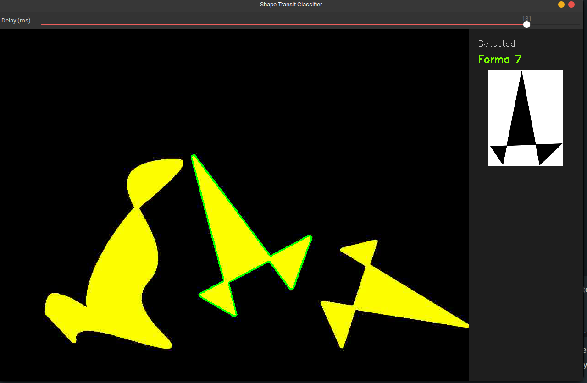

# Shape Transit Classifier - Reporte de Proyecto

Este documento sirve como reporte académico para la asignatura así como documentación técnica principal del repositorio. En él se detalla la metodología, los algoritmos utilizados y los resultados obtenidos en el desarrollo del clasificador de formas geométricas en video.

**Repositorio oficial:** [github.com/saulcanche/shape-transit-classifier](https://github.com/saulcanche/shape-transit-classifier)

## 1. Introducción y Objetivo

El objetivo de este proyecto es desarrollar un programa en C++ utilizando la biblioteca OpenCV que lea un flujo de video y, de manera automática, detecte, aísle y clasifique objetos geométricos conforme estos transitan por el centro de la imagen.

El sistema debe evaluar estas figuras en movimiento y compararlas con una base de datos predefinida de 17 formas de referencia para identificarlas correctamente y producir como salida un listado de los identificadores detectados.

 *Figura 1: App*


*Figura 2: Conjunto de las 17 formas de referencia a clasificar.*

## 2. Metodología y Decisiones de Diseño

Para asegurar la robustez del clasificador frente a las variaciones naturales de escala y cambios de posición durante los cuadros de video, la arquitectura se basó en la extracción y evaluación de dos descriptores matemáticos principales:

### 2.1. Momentos de Hu
Los Momentos de Hu son un conjunto de 7 valores calculados a partir de los momentos espaciales de la silueta.
* **Justificación:** Son ampliamente conocidos por ser invariantes a la escala, rotación y traslación, lo que permite obtener una descripción global de la distribución de masa de la figura.
* **Implementación:** Debido a la amplia diferencia en magnitudes (algunos valores son extremadamente pequeños), la distancia euclidiana tradicional en el vector no es efectiva. Por ello, la proximidad entre momentos de Hu se calcula en su espacio logarítmico.

### 2.2. Descriptores de Fourier (FFT)
Dado que los Momentos de Hu por sí solos pueden traslaparse en formas de masa similar, se utilizaron Descriptores de Fourier aplicados directo al contorno.
* **Justificación:** Permiten comparar el detalle estructural fino del perímetro de las formas.
* **Implementación:** Se convirtió el contorno a un arreglo de números complejos (tomando la distancia de cada perímetro respecto al centroide) y se aplicó la Transformada Discreta de Fourier (`cv::dft`). Para asegurar la invariancia a la escala, las componentes frecuenciales se normalizan respecto a la frecuencia fundamental.

### 2.3. Clasificación y k-NN
El emparejamiento final del transito con su clase correspondiente se realiza mediante el algoritmo de *k-Vecino Más Cercano* ($k=1$), evaluando una distancia ponderada:
```cpp
double totalDistance = huWeight * huDistance + fftWeight * fftDistance;
```
Este método equilibra las proporciones del bloque grueso global (Momentos Hu) y el enfoque en ángulos cerrados perimetrales (Descriptores FFT).

## 3. Funciones Principales Implementadas

Se construyó una estructura aislada, desacoplando la lectura óptica de la evaluación predictiva. A continuación el propósito de las funciones internas del proyecto:

### Procesamiento Geométrico ([`src/image_processing.cpp`](https://github.com/saulcanche/shape-transit-classifier/blob/main/src/image_processing.cpp))
* [`extractLargestContour`](https://github.com/saulcanche/shape-transit-classifier/blob/main/src/image_processing.cpp#L3-L12): Filtra los restos de ruidos de segmentación localizando jerárquicamente a la forma de mayor masa observable en la escena.
* [`computeCentroid`](https://github.com/saulcanche/shape-transit-classifier/blob/main/src/image_processing.cpp#L14-L18): Emplea la estadística de momentos espaciales base de OpenCV para calcular el baricentro real de la silueta en pixeles.
* `isAtCenter`: Desencadena el trigger del evaluador iterativo únicamente cuando el baricentro se acerca considerablemente a la tolerancia del eje simétrico ($x$) central de la pantalla.
* [`resampleContour`](https://github.com/saulcanche/shape-transit-classifier/blob/main/src/image_processing.cpp#L64-L110): Recalcula perimetralmente e interpola un contorno con logaritmo regular. Garantiza contar con el mismo número predeterminado estándar de vértices distribuidos uniformente para las mediciones homólogas (ej. `256 vértices`).
* [`contourToComplexSignature`](https://github.com/saulcanche/shape-transit-classifier/blob/main/src/image_processing.cpp#L40-L49): Reubica los ejes base hacia un plano imaginario ($R \cdot e^{j \theta}$) midiendo el perímetro versus el baricentro espacial.
* [`computeFFTDescriptors`](https://github.com/saulcanche/shape-transit-classifier/blob/main/src/image_processing.cpp#L51-L62): Ejecuta la convolución armónica `cv::dft`, suprimiendo variaciones normalizando cada componente de la Transformada de Fourier con la base predominante.

### Mecanismos de Evaluación ([`src/classification.cpp`](https://github.com/saulcanche/shape-transit-classifier/blob/main/src/classification.cpp))
* [`loadReferenceDescriptors`](https://github.com/saulcanche/shape-transit-classifier/blob/main/src/classification.cpp#L7-L38): Método orquestador encargado de recorrer e inyectar dinámicamente los tensores descriptivos invariantes del bloque `.png` referencial de validación.
* [`distanceHuMoments`](https://github.com/saulcanche/shape-transit-classifier/blob/main/src/classification.cpp#L40-L47) / [`distanceFFT`](https://github.com/saulcanche/shape-transit-classifier/blob/main/src/classification.cpp#L49-L61): Cómputos complementarios para acumular en flotantes el error marginal que separa una propuesta contra un marco de control.
* [`classifyShape`](https://github.com/saulcanche/shape-transit-classifier/blob/main/src/classification.cpp#L63-L78): Busca el vector absoluto de distancias mínimas para emparejar la forma identificando el ID óptimo referencial.

## 4. Implementación del Algoritmo Principal

El núcleo del clasificador implementa la lógica de k-NN ponderada. A continuación se muestra el cálculo de distancia ponderada utilizado en [`classifyShape`](https://github.com/saulcanche/shape-transit-classifier/blob/main/src/classification.cpp#L63-L78):

```cpp
int classifyShape(const ShapeDescriptor& query,
                  const std::vector<ShapeDescriptor>& refs,
                  double huWeight, double fftWeight)
{
    double minDistance = std::numeric_limits<double>::max();
    int bestId = -1;
    for(const auto& ref : refs) {
        double huDistance = distanceHuMoments(query.huMoments, ref.huMoments);
        double fftDistance = distanceFFT(query.fftDescriptors, ref.fftDescriptors);
        double totalDistance = huWeight * huDistance + fftWeight * fftDistance;
        if(totalDistance < minDistance) {
            minDistance = totalDistance;
            bestId = ref.id;
        }
    }
    return bestId;
}
```

Para más detalles sobre la arquitectura completa, véase [`main.cpp`](https://github.com/saulcanche/shape-transit-classifier/blob/main/src/main.cpp) que orquesta todo el flujo de procesamiento de video.

## 5. Retos Técnicos

### 5.1. Muestreo de Contornos y `CHAIN_APPROX_SIMPLE`
En un inicio, el algoritmo clasificatorio colapsaba sistemáticamente al transitar el video evaluando rectángulos debido al aproximador paramétrico `cv::CHAIN_APPROX_SIMPLE`. Este atajo interno ahorra carga reduciendo los tramos verticales reduciendo el rectángulo a exactamente 4 coordenadas perimetrales, arruinando al comparador de Transformada Uniforme respecto a bordes curveados más ricos analíticamente. Intervenir reubicando puntos forzados mediante *longitud de arco* en el `resampleContour` estabilizó los valores a uniformes escalables.

### 5.2. Inestabilidades en Matrices Simétricas (Logaritmos)
Aquellas geometrías inherentemente perfectas o hiper-simétricas producían vectores complementarios matemáticamente invisibles (ceros absolutos). El colapso del sistema acontecía al aplicar las conversiones iterativas para estabilización de las varianzas en `std::log(0)` originando de regreso banderas `NaN`.  Elevando el factor de ruido bajo (`noise floor parameter`) a una tolerancia constante artificial (`1e-15`), el compilador fue resguardado contra excepciones indefinidas.

## 6. Resultados

La solución fue validada usando [GTest](http://google.github.io/googletest/) para bloques matemáticos modulares unitarios y un controlador global iterando transiciones y superposiciones. Véase [`test/test_classification.cpp`](https://github.com/saulcanche/shape-transit-classifier/blob/main/test/test_classification.cpp) para los detalles de las pruebas unitarias implementadas.

**Resumen de Carga del Sistema:**
* **Detección Espacial de Frecuencia:** **50/50** de las figuras del trayecto capturadas en cruce y aisladas.
* **Precisión Final del Evaluador:** **40/50** de acierto total sobre referenciador ID cruzado.
* **Accuracy Promedio Cíclico:** **80.00%**

La salida integral obtenida por consola desde el script de validación [`scripts/calculate_precision.py`](https://github.com/saulcanche/shape-transit-classifier/blob/main/scripts/calculate_precision.py):

```text
Total Expected: 50
Total Actual: 50
Mismatch at 0: Expected figId =  11, Actual figId =  12
Mismatch at 7: Expected figId =  11, Actual figId =  12
Mismatch at 9: Expected figId =  2, Actual figId =  3
Mismatch at 13: Expected figId =  0, Actual figId =  3
Mismatch at 18: Expected figId =  2, Actual figId =  13
Mismatch at 24: Expected figId =  13, Actual figId =  3
Mismatch at 27: Expected figId =  11, Actual figId =  12
Mismatch at 30: Expected figId =  11, Actual figId =  12
Mismatch at 44: Expected figId =  3, Actual figId =  2
Mismatch at 46: Expected figId =  2, Actual figId =  3

Accuracy: 40/50 = 80.00%
```

### 6.1. Análisis Excepcional de los Casos Recurrentes de Confusión

La gran parte del índice de error recae sistemáticamente en confusiones entre geometrías que presentan firmas perimetrales fuertemente similares cuando cruzan el espectrómetro en resoluciones bajas.

**Confusión Reiterativa: Forma 11 vs Forma 12**
En ambos casos, muestran protuberancias estiradas. Cuando se discretizan por ruido la distancias analíticas se invierten logrando márgenes residuales traslapados.

| Forma 11 Esperada | Forma 12 Falsa Positiva detectada |
| :---: | :---: |
|  |  |
| *Forma 11: Muestra asimetrías diagonales hacia ángulos opuestos de su contraparte.* | *Forma 12: Las sumas parciales FFT caen muy cerca a pesar de ser formas inversas reflejadas.* |

**Confusión Reiterativa: Forma 02 vs Forma 03**
El caso es idéntico a pares masivos de características gruesas como el número 2 y 3.

| Forma 02 Esperada | Forma 03 Falsa Positiva detectada |
| :---: | :---: |
|  |  |
| *Forma 02: Geometría dentada de menor amplitud.* | *Forma 03: Proyección en video levemente alterada puede converger su Momentum global al mismo de la 02.* |

Se concluye que el balance adaptado proporciona viabilidad funcional alta siendo permisivo en rotaciones no lineales y ruido compresivo natural pero sacrificando exactitud inquebrantable frente a firmas orgánicas cruzadas.
